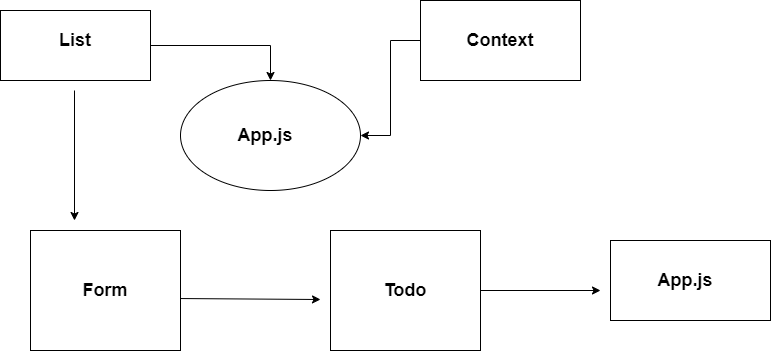

# todo-app

# sandBox
### [sandbox](https://codesandbox.io/s/confident-hertz-ezkp8?file=/src/app.scss:3-145)

# Uml 

# sandBox lab 32

## [sandbox](https://codesandbox.io/s/young-snowflake-byqwx)

# sandBox lab 33
## [sandbox](https://codesandbox.io/s/cocky-pine-mlr1m?file=/package.json)

# Development Process 

## Phase 1:
- Basic To Do List Management, using Hooks
Global State
Context API

## Phase 2:
- adding an Setting Form so that users can save their preferences for the application, allowing them to change some of the default behaviors

Implement a custom Form Hook
save the selection to local storage.

 # Phase 3:
 - Adding security and access controls to the application.

In this final phase, we’ll be requiring that users be logged in, in order to see the to do items. Additionally, based 